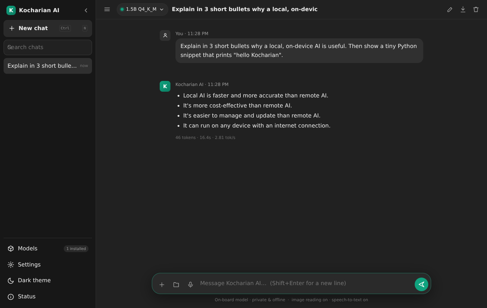

# Kocharian AI

A private, ChatGPT-style assistant that runs **entirely on your own machine** with an **on-board Qwen GGUF model**
(1.5B parameters, `Q4_K_M`) through [llama.cpp](https://github.com/ggml-org/llama.cpp).
No account, no API key, nothing leaving the computer — and it accepts **images, audio and documents**,
reading them locally with OCR and speech-to-text.



## Features

**Chat**
- Streaming answers (token by token) with stop / regenerate / edit-and-resend / copy / delete.
- Markdown, tables, code blocks with syntax highlighting and copy buttons, light & dark theme.
- History kept locally in `data/conversations/` — search, rename, pin, delete, export to Markdown.
- Per-answer stats: tokens, seconds, tokens/second.

**On-board model**
- A **Qwen 1.5B instruct `Q4_K_M` GGUF** is installed automatically on first run (≈1.1 GB) and loaded into memory
  at start-up, so the first message answers immediately.
- The Models panel shows the real GGUF metadata (architecture, quantization, context length, size) and can
  **test a model** with a one-click self-test.
- Get more models without leaving the UI: curated downloads (**Qwen1.5-1.5B-Chat `Q4_K_M`**, the classic 1.5B chat
  model), any Hugging Face repo/file, any direct URL, a **PyPI-chunks fallback** for networks where Hugging Face is
  blocked, or import a `.gguf` you already have (resumable chunked upload from the browser).
- Settings for temperature, top-K/top-P, repeat penalty, max tokens, context size, CPU threads and chat template.

**Images** — upload, drag & drop, paste, or import from your upload library
- Offline OCR: **PP-OCR / RapidOCR** when `vendor/python` is present (`npm run setup:ocr`), otherwise the bundled
  **tesseract.js** WASM engine. Dimensions/format detection, thumbnails and a viewer with the extracted text.
- The recognised text is injected into the prompt, so “what invoice number is in this picture?” just works.
- Optional: an OpenAI-compatible key in Settings adds full image *descriptions* (vision) and cloud transcription.

**Audio** — file upload (mp3, wav, m4a, ogg, webm, flac, video soundtracks) or microphone recording
- Decoded in the browser to 16 kHz mono WAV, then transcribed locally with **whisper.cpp**
  (`models/whisper/ggml-base.en-q5_0.bin`, ≈55 MB, `npm run setup:whisper` to rebuild).
- The transcript is handed to the model, so you can ask for summaries, action items or translations.

**Documents**
- Text/code/CSV/JSON/Markdown read directly; **PDFs** extracted with `pdfjs-dist`; all of it becomes prompt context.

## Quick start

```bash
npm install          # dependencies (node-llama-cpp ships prebuilt llama.cpp binaries)
npm start            # → http://localhost:3000
```

*On first run the on-board Qwen model is downloaded automatically* (progress is visible in the UI).
Set `KOCHARIAN_AUTO_PROVISION=0` to skip that, `PORT=8080` for another port, `HOST=0.0.0.0` is the default.

### Optional extras (one command each, fully offline afterwards)

```bash
npm run setup:whisper   # builds whisper.cpp into tools/whisper/ + installs & quantizes the Whisper model
npm run setup:ocr       # PP-OCR models + onnxruntime into vendor/python (better OCR than tesseract.js)
npm run setup           # both of the above
```

### Getting more models

```bash
node scripts/models.js                                           # list installed + curated models
node scripts/models.js --curated qwen1_5-1_5b-chat-q4_k_m.gguf    # Qwen1.5-1.5B-Chat Q4_K_M (HF + mirrors + PyPI fallback)
node scripts/models.js --hf TheBloke/Mistral-7B-Instruct-v0.2-GGUF mistral-7b-instruct-v0.2.Q4_K_M.gguf
node scripts/models.js --url https://example.com/model.gguf
node scripts/models.js --meta models/your-model.gguf             # inspect any GGUF
```

The same options are in the UI (**Models** in the sidebar), including **import a GGUF file** from disk.

## Layout

```
server/          HTTP + SSE server, inference engine, GGUF reader, attachment pipelines
public/          the whole UI (vanilla ES modules — no build step, no framework)
scripts/         model provisioning + setup helpers
models/          GGUF models (the on-board model lives here) + models/whisper/ ASR models
tools/           whisper.cpp binary & libraries, OCR worker, tesseract language data
data/            conversations, uploaded files, settings (all local, all yours)
```

## API

| Method | Path | Purpose |
| --- | --- | --- |
| `GET` | `/api/health` | engine status, capabilities, settings, provisioning progress |
| `GET/POST` | `/api/settings` | read/update settings (`{resetAll: true}` restores defaults) |
| `GET` | `/api/models` | installed models (with GGUF metadata) + curated downloads |
| `POST` | `/api/models/activate` | load a model into memory |
| `POST` | `/api/models/test` | run a quick self-test on a model |
| `POST` | `/api/models/download` | start a download (`{curated}` or `{source, repo, file, url}`) |
| `GET/DELETE` | `/api/models/download/:id` | progress / cancel |
| `POST` | `/api/models/upload` | resumable GGUF import (chunked) |
| `GET/POST` | `/api/conversations` | list/create chats |
| `PATCH/DELETE` | `/api/conversations/:id` | rename/pin/delete |
| `POST` | `/api/chat` | chat completion — **SSE** stream of `meta`, `status`, `token`, `done`, `saved`, `error` |
| `POST` | `/api/chat/stop` | abort the current generation |
| `GET/POST` | `/api/uploads` | attachment library / upload (analysis runs automatically) |
| `POST` | `/api/uploads/:id/analyze` | re-run OCR / transcription for an attachment |
| `GET` | `/api/files/:id` | serve an uploaded file |

## Use it on your phone

Kocharian AI is a installable PWA **and** ships a native iOS wrapper.

1. Run `npm start` on your computer and open <http://localhost:3000>.
2. Click **Get it on your phone** in the sidebar — it shows a LAN URL and a QR code.
3. Scan it with the phone (same Wi-Fi), then
   * **iPhone (Safari)** — Share ⬆ → *Add to Home Screen*
   * **Android (Chrome)** — ⋮ → *Install app*

Prefer a real native build? Open `ios/KocharianAI.xcodeproj` in Xcode, set your
signing team and press Run. Full walkthrough: [docs/XCODE.md](docs/XCODE.md).

## Keyboard shortcuts

`Enter` send · `Shift+Enter` newline · `Ctrl+N` new chat · `Ctrl+K` search chats · `Esc` close dialogs.

## Performance notes

Inference runs on the CPU. `threads` defaults to the number of CPU cores — **do not oversubscribe**
(on a 2-core machine, 4 threads can be an order of magnitude slower than 2). A 1.5B `Q4_K_M` model needs about
1.5 GB of RAM, works with no GPU, and answers at roughly 5–12 tokens/second on two modern cores; small models
(≤360 M) reach 40+ tokens/second.

## Privacy

Chats, images and audio are processed by local binaries on your machine. The only network calls are the ones *you*
trigger: model downloads, or the optional cloud fallback if you paste an API key into Settings.

## Troubleshooting

- **“No model available”** — open *Models* and download one, import a `.gguf`, or run
  `node scripts/models.js --curated qwen1_5-1_5b-chat-q4_k_m.gguf`.
- **Hugging Face is blocked** — the curated downloads fall back to mirrors and then to chunked PyPI packages
  (that is how the default model installs on first run).
- **Audio says speech-to-text is unavailable** — run `npm run setup:whisper` (needs `git` and a C++ toolchain).
- **Image text looks off** — `npm run setup:ocr` installs the stronger PP-OCR engine; a cloud vision key also works.
- **Slow answers** — lower *Max new tokens* / *Context size*, keep threads equal to CPU cores, and pick a smaller model.
